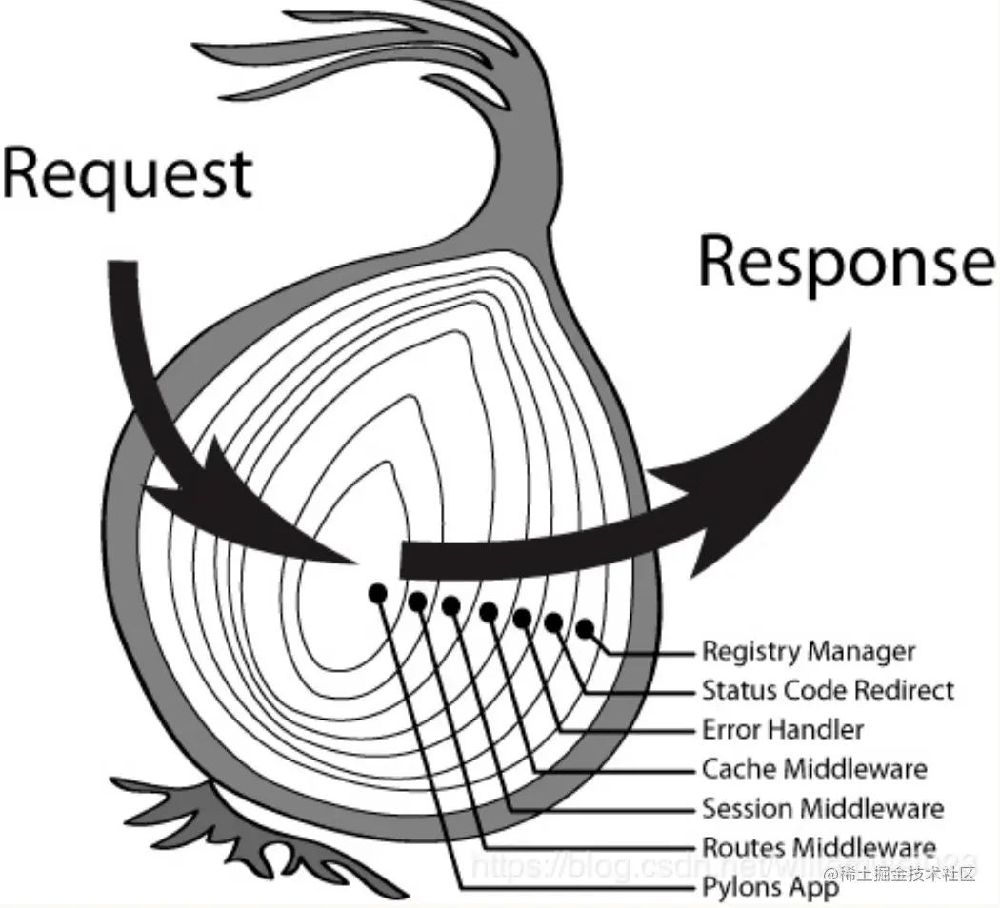

## Summary and learning

1. Redux itself only take care of state update but it provide a way
   for others to insert other logic for example log the state before and after state change

   so we need a why to add others code without effect our own logic

2. In JS world it is very nature to think that using higher-order-function, third party pass
   there function into redux, and redux will call it before and after the invoke of reducer

   so what does those middleware needs, the `state` for sure because they need state to do something
   hence the basic idea of middleware would be someone pass functions to redux
   and the dispatch fn will call this function

   ```js
   function middlewareFn(state) {
     // i will do something
   }

   function reducer() {}
   // so add this to the dispatch function
   function createStore(reducer, middlewareFn) {
     // ... rest of code
     function dispatch(action) {
       // invoke passed fn, assume we only have one for now
       // listOfFn.forEach((fn) => fn());
       middlewareFn();

       state = reducer(state, action);
       for (let i = 0; i < listeners.length; i++) {
         const listener = listeners[i];
         listener();
       }
     }
   }
   const store = createStore(reducer, [middlewareFn1, middlewareFn2]);
   ```

3. However, we have a problems here, we can only call the function before or after the reducer fn,
   but normally we wants to execute our code before `and` after the reducer fn.
   3.1 the easiest way is just pass pass 2 function as one, like loggerBefore, and loggerAfter

   ```js
   const middleFnV2 = {
     before: (state) => console.log("logger before", state),
     after: (state) => console.log("logger after", state),
   };
   function createStore(reducer, middleFnV2) {
     // ... rest of code
     // logic that put
     function dispatch(action) {
       // invoke passed fn
       middleFnV2.before(state);

       state = reducer(state, action);

       middleFnV2.after(state);

       // invoke listener
     }
   }
   ```

   it actually works, and very easily fit into my mental model, however it is js so redux take a more functional programming way(maybe other things that stop this approach, we can take a look later)

   3.2 The other way to think of this is the the `Onion architecture` `recursion`, we first execute some part of the code, and go to next layer, execute the rest of code when it come back
   

4. How this model works?
   1. it will call first part of the middleware function (that we passed in not sure if it is passed)
   2. and calls the next function(the function repeatedly do 1 and 2)
   3. after it comeback like a recursion, it call the second part of the function
   4. but one function is a whole, how can we call the separate part of the function? no we can't
      Unless we put other's code inside our code like a sandwich

We are gonna talk more about this tmr
